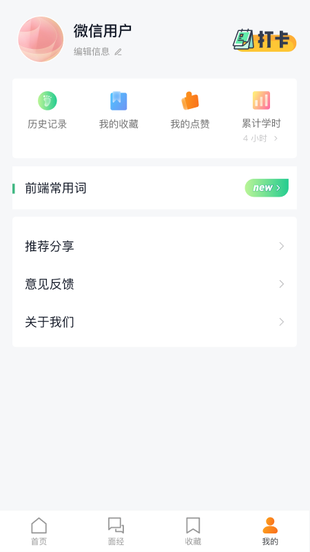

  

## 面试宝典App

[fork地址:https://github.com/HarmonyOS-Next/interview-handbook-project](https://github.com/HarmonyOS-Next/interview-handbook-project)

项目介绍：面向前端程序员的刷题应用，提供前端常见问题、项目商务面试问题、面试体验等内容服务。

开发者：依羽淡蓝/YiYuTET

项目整体基于ArkTs + ArkUI + Api9 + Stage模式

后端数据接口：https://api-harmony-teach.itheima.net/hm/

具体包含功能如下：

1、常用组件的提取；

2、网络请求的基础封装(基于Promise)；

3、封装项目页面多状态（加载中，成功，失败，空数据）；

4、router页面路由；

5、LocalStorage页面状态存储；

6、新增mediaQuery使用模板

7、添加全局loading实现

8、新增emitter

9、其它功能正在开发......

具体更多内容，请下载项目了解更多

版权协议: BY-NC-ND 4.0

本站所有资料和图片均来自互联网收集而来，版权归原创者所有，本网站只提供web页面服务，并不提供资源存储，也不参与录制、上传，若本站收录的资料无意侵犯了贵司版权，请联系作者。

联系方式：（微信）zyw2576556095TE、（邮箱）[2576556095@qq.com](2576556095@qq.com)

## 界面预览

